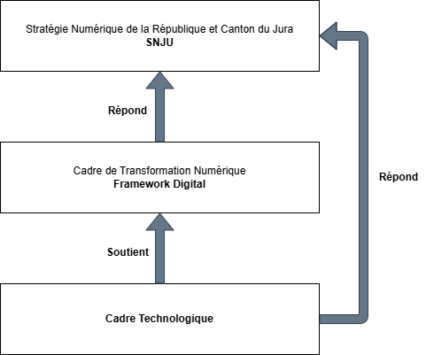

#cadre_technologique

# Cadre Technologique du Service Informatique de la République et Canton du Jura

Le cadre technologique du service informatique de la République et Canton du Jura (ci après SDI) à pour but de fixer les règles générales et la vision de la technologie au niveau des réalisations du SDI. 
Ce cadre technologique est dirigé et alimenté par deux sources différentes:

- **Cadre de transformation numérique**: qui définit les grandes orientations numériques, au sens global du terme du SDI
- **Stratégie numérique de la République et Canton du Jura** (SNJU): qui définit la stratégie numérique global pour l'état du Jura

Le Cadre Technologique du SDI doit prioritairement **soutenir** le Cadre de Transformation Numérique. Toutefois, il va aussi directement **répondre** a des éléments de la stratégie indépendamment du Cadre de Transformation Numérique

![[Cadre technologique du Service Informatique de la République et Canton du Jura/Untitled Diagram.svg]]

- [2. Vision et objectifs](2.%20Vision%20et%20objectifs.md)

## Gouvernance

    Comité de pilotage restreint (3-5 personnes) : décide rapidement, évite les lourdeurs hiérarchiques.

    Rôles clairs :

        Sponsor : valide et porte la vision.

        Responsable transformation : coordonne et suit l’avancement.

        Référents métier : assurent l’adéquation avec les besoins terrain.

    Cycle de décision rapide : réunions courtes et régulières (par ex. toutes les 2 semaines).

## Méthodes de travail/Incréments technologiques

    Pilotes : lancer des projets test sur un périmètre réduit avant un déploiement global.

    Feedback rapide : recueillir l’avis des utilisateurs et mesurer l’impact dès les premières semaines.

    Ajustement continu : affiner ou pivoter en fonction des résultats.

## Cadre d’utilisation et bonnes pratiques

    Charte technologique : document court (2-3 pages) qui précise :

        Les technologies autorisées / non autorisées.

        Les règles de sécurité et de confidentialité.

        Les critères de choix d’un nouvel outil.

    Documentation vivante : simple et mise à jour en continu.

## Mesure et communication

    Tableau de bord avec indicateurs-clés (adoption, performance, incidents, ROI).

    Communication régulière : partager les succès, les leçons apprises et les prochaines étapes.

    Boucles de retour : prévoir des points trimestriels pour réviser le cadre.

## Culture

    Former en continu (courtes sessions, e-learning).

    Identifier des ambassadeurs internes pour promouvoir les nouveaux outils.

    Célébrer les réussites pour encourager l’engagement.

## Plan à 5 ans

- Suppression des SPOF
- Requalification du périmètre des outils
- Choix technologiques claire spour la virtualisation
- Définition des providers "publiques" Cloud