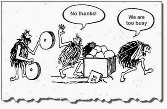

### Principe de la roue carrée
> **les équipes peinent souvent à gérer des processus inefficaces (roues carrées), alors que des solutions plus performantes (roues rondes) existent déjà mais sont négligées**

### Mais...
> **soyons d'autant plus exigeants que l'innovation est géniale, d'autant plus critiques que sa promesse est belle**
