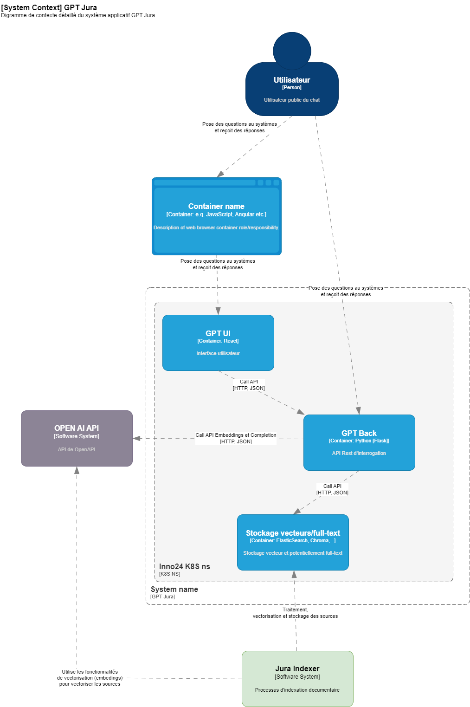
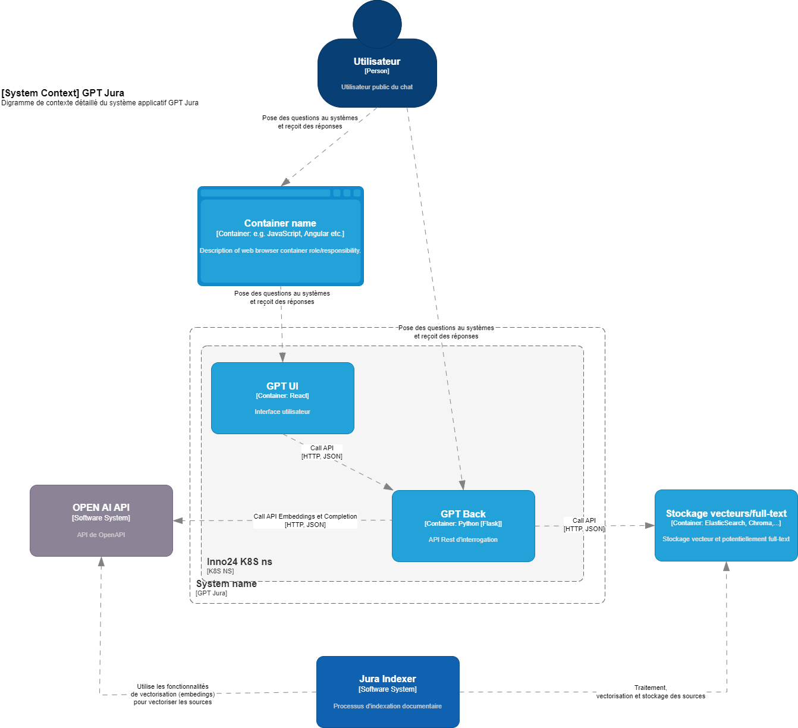

#inno24 #elasticsearch


# Vue globale du projet

  
Le projet est un assistant (sous forme de chatbot) destinée à répondre aux questions générales administratives des citoyens sur la base de données publiques.

  

## Architecture avec Elasticsearch déployé sur K8S

  



  
  

- Cluster de 3 noeuds master

- Ressources limits k8s de chacun des noeuds

    - CPU: 500m

    - RAM: 2Gi

    - Stockage actuel sur persistent volume NFS

  
  

### Architecture prévue avec utilisation de Elasticsearch mutualisé

  



  
  

- Cluster sur 4 noeuds 3 Master+Hot / 1 Cold

  

## Index utilisées pour le projet RAG

- **inno24-small, inno24-large**, index standard avec champ dense_vector 1536 (3012 pour large)

- **interactions**, index texte standard stockant le sinteractions utilisateurs

- **templates**, stockage des prompts

- **questions**, stockage des question pré-re,plies comme exemple

  

### Taille des index

  

- **inno24-small et inno24-large**: actuellement ~900 documents, 170 MB (pour large), à prévoir (estimation): ~5000 documents, 1GO

- Pour les autres index cela me parait anecdotique (interactions actuellement 60MB, au pire 1Go/an, purement arbitraire)

  

### Mappings des index

- les mappings sont fournis en pièce jointe (fichier mappings.json)

  

## Thématiques/Questions SDI pour le workshop

```Décision a été prise d'utiliser le cluster mutualisé. Dans ce contexte, quelles sont les bonnes pratiques en termes de gestion des index (nommage en fonction des environnements, dimensionnement) ?```

  

> index séparé, ok. 1 Index par environnemet, stratégie de nommage

  

> Définition des ILM. Templates a utiliser, niveau component, niveau index

  

> Dimensionnement: 20% de plus que le besoin de base (ram). S'assurer dec celà avec FaWi.

  

> utilisation de PowerBi pas heureuse pour la visualisation, utilisation de Kibana à préférer ! Espaces inno24 à prévoir.

  

```Stratégie d'indexation des documents (update, supression complète et réinjection) ?```

> Dans le cas de données publiques (notre contexte):

  

> Ne pas pas privilégier l'update, ES prévue pour des données statiques

  

> Privilégier refresh complet. Surtout dans le cas ou peu de documents. Le volume ne le justifie pas.

  

> Actuellement on vide l'index. On ne le créé pas. C'est à privilégier

  

> Supprimer l'index est plus efficient, dans le cas ou le template et les mappings sont là !

  

```Efficience des mappings utilisées ? Principalement pour les documents inno24```

> Mapping:

  

> Mapping et ILM sont différents

  

> ILM pour gestion du cycle de vie des données des index

  

> Le mapping est pour la structure, schema

  

> Par défaut la configuration est décidée par ES, si pas de mapping

  

> type text et keyword,

  > texte doit être indexé, tout le process est lancé

  > keyword est un mot

  > ce n'est pas au moment de la recherche que le mot est indexé, c'est fait avant

  

> Concept de Shard

  

> Indexer en texte uniquement ce qui a un sens

  

> Un texte ne peut pas être aggrégé

  

> mettre en place 2 index

  > un avec mapping défini

  > un autre libre

  

> Structure Rechercherche sur metadata et

  

> ElasticSearch Nested si données liées (nom et prénom)

  

> besoin de type texte avec vector. Enlever le keyword

  

> Taille du keyword max: 256

  

```Gestion de cache possible avec Elasticsearch ?```

  

> N/A

  

> Possible quand le besoin sera là (TB)

  

> Répétition de query (pas notre cas)

  

> 3 types de caches:

  > Cache "page" : niveau OS mémoire, pas le plus fiable (en termes de perf)

  > Cache "query": pour répétion de query, cache par requête

  > Cache "query" / partition --> Invalidation de cache

  

```Différence entre recherche sématique knn et recherche bm25 dans le cadre d'un projet RAG ?```

  

> knn natif elastic, recommandé (min 8.12 ou +), voir si en dessous, pas terrible en terme de latence

  

> bm25 couplé avec knn, cas d'usage avéré

  

```Utilité de gérer des index séparées pour des données différentes (isolation métier, par thématique ) ?```

  

> Décision à prendre en fonction des besoins

  

> Séparation "light"

  > Index différents mais template (structure égale)

  > Gestion du cycle de vie des données

  > Recherche sur plusieurs index en même temps complexifie

  

```Impacts potentiels à prévoir sur le cluster existant d'utiliser une recherche par similarité vectorielle (ce qui n'est pas le cas actuellement) ?```

  

> La recherche vectorielle est consommatrice, plus que texte

  

> Plus "lourde" en terme de RAM, mais proportionelle au volume

  

> A voir avec FaWi dans le contexte log-events

  

```Bonnes pratiques générales, recommandations et expériences dans le cadre de projets RAG ?```

  

```Next```

  

> Mapping

  

> ILM

  

> Templates/Index