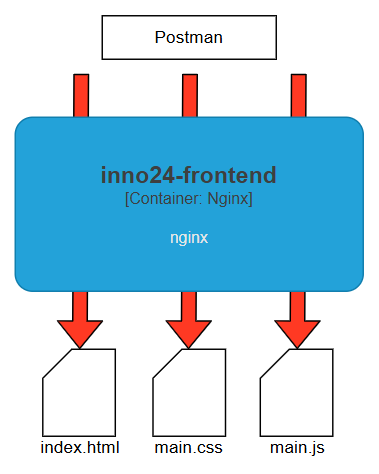

- Depuis Postman --> 429 TooManyRequest à tester
- Ok, conversaton id limits

# Test performances avec postman

## Test front (nginx statique)

### Résultats

![[../perf-results/inno24-fromtend.html]]

## Test back (sans OpenAI)

### Résultats

![[../perf-results/inno24-backend.html]]

## Test back (completion)

### Résultats

2 VU - 1 minutes

| VU's    | Durrée | Résultat   | Résultats                                             | logs                 | requetes/min       |
| ------- | ------ | ---------- | ----------------------------------------------------- | -------------------- | ------------------ |
| 2 fixed | 2'     | ok         | ![[../perf-results/inno24-backed-pefrs-performance-report-12 1.html]] |                      | 18                 |
| 4 fixed | 2'     | ok         | ![[../perf-results/inno24-backed-pefrs-performance-report-13.html]]   |                      | 28                 |
| 8 fixed | 2'     | ko partiel | ![[../perf-results/inno24-backed-pefrs-performance-report-14.html]]   | ![[../perf-results/8fixed1min.logs]] | 86 (25% en erreur) |
|         |        |            |                                                       |                      |                    |

### Explication:

nbre tokens:  4280 (complet)
plafond openai api par minutes: 200'000
--> 200'000 / 4280 --> 46,8 requêtes par minutes

Postulat:

10 utilisateurs en même temps
3 requêtes par minutes (questions)
token moyen: 6000

**Cas 1: 10 utilisateurs envoie 3 appels en même temps durant une minute**
$$
10 u * 3 r * 6000 = 180'000
$$

**Cas 2: 200 utilisateurs envoie 1 requête en une minute**
$$
200 u * 1r * 6000 = 1'200'000
$$

Cas raisonnable: 

Rate Limiting API

- 3 requêtes par minutes par IP
- Géofencing Suisse

Projection 

100 utilisateurs en même temps:

- 1 requête étalées sur 2 minutes
- ~50 requêtes par minutes
